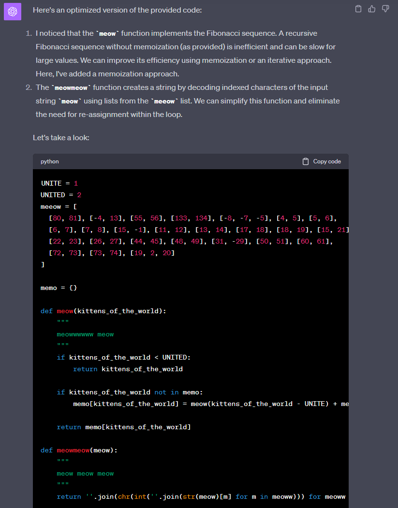

# Cat code

## Zadání

```
Ahoy, officer,

due to the lack of developers on board, the development of the access code generator for the satellite connection was entrusted to the cat of the chief officer. Your task is to analyze the cat's creation and find out the code.

May you have fair winds and following seas!

meow.py
meowmeow.py
```

## Řešení

Před spuštěním programu `meowmeow.py` zrušíme test na `meoword` a nastavíme `kittens`:

```python
from meow import meow, meowmeow

def meoow():
    #meoword = ''
    #while meoword != 'kittens':
    #    meoword = input('Who rules the world? ')
    #    if meoword in ['humans', 'dogs']:
    #        print('MEOW MEOW!')
    meoword = 'kittens'
    print(meowmeow(meow(sum([ord(meow) for meow in meoword]))))


if __name__ == '__main__':
    meoow()
```

V `meow.py` odstraníme `print` jinak se nám konzole zaplní nevyžádaným textem:

```python
def meow(kittens_of_the_world):
    """
    meowwwwww meow
    """
    #print('meowwww ', end='')
    if kittens_of_the_world < UNITED:
        return kittens_of_the_world
    return meow(kittens_of_the_world - UNITE) + meow(kittens_of_the_world - UNITED)


def meowmeow(meow):
    """
    meow meow meow
    """
    meeoww = ''
    for meoww in meeow:
        #print('meowwww ', end='')
        meeoww = f"{meeoww}{chr(int(''.join(str(meow)[m] for m in meoww)))}"
    return meeoww
```

Program ovšem i tak po spuštění zůstane viset, protože výpočet vlajky je příliš pomalý. Jedná se o Fibonacciho posloupnoust - s optimalizací pomůže ChatGPT-4.

Prompt: Optimize this python code



```python
UNITE = 1
UNITED = 2
meeow = [
  [80, 81], [-4, 13], [55, 56], [133, 134], [-8, -7, -5], [4, 5], [5, 6],
  [6, 7], [7, 8], [15, -1], [11, 12], [13, 14], [17, 18], [18, 19], [15, 21],
  [22, 23], [26, 27], [44, 45], [48, 49], [31, -29], [50, 51], [60, 61],
  [72, 73], [73, 74], [19, 2, 20]
]

memo = {}

def meow(kittens_of_the_world):
    """
    meowwwwww meow
    """
    if kittens_of_the_world < UNITED:
        return kittens_of_the_world

    if kittens_of_the_world not in memo:
        memo[kittens_of_the_world] = meow(kittens_of_the_world - UNITE) + meow(kittens_of_the_world - UNITED)

    return memo[kittens_of_the_world]

def meowmeow(meow):
    """
    meow meow meow
    """
    return ''.join(chr(int(''.join(str(meow)[m] for m in meoww))) for meoww in meeow)
```

## Vlajka

```
FLAG{YcbS-IAbQ-KHRE-BTNR}
```
