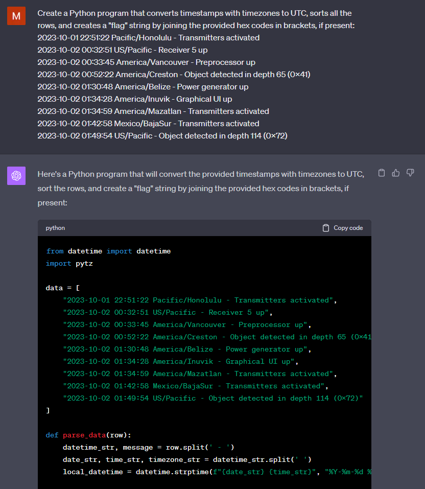

# Sonar logs

## Zadání

```
Ahoy, officer,

each crew member must be able to operate the sonar and understand its logs. Your task is to analyze the given log file, and check out what the sonar has seen.

May you have fair winds and following seas!

Update: Be aware that some devices do not use up-to-date libraries - this sonar, for example, is based on python and uses an old pytz library version 2020.4.

The Logs:
2023-10-01 22:51:22 Pacific/Honolulu - Transmitters activated
2023-10-02 00:32:51 US/Pacific - Receiver 5 up
2023-10-02 00:33:45 America/Vancouver - Preprocessor up
2023-10-02 00:52:22 America/Creston - Object detected in depth 65 (0x41)
2023-10-02 01:30:48 America/Belize - Power generator up
2023-10-02 01:34:28 America/Inuvik - Graphical UI up
2023-10-02 01:34:59 America/Mazatlan - Transmitters activated
2023-10-02 01:42:58 Mexico/BajaSur - Transmitters activated
2023-10-02 01:49:54 US/Pacific - Object detected in depth 114 (0x72)
...
```

## Řešení

Log obsahuje datum, čas, časovou zónu a událost. V závorce některých událostí je uveden hex kód vlajky - `Object detected in depth 65 (0x41)`.
Znaky vlajky tak musíme seřadit podle času. Řešení pomocí ChatGPT-4:



Stačili pouze dvě úpravy - načíst data ze souboru a upravit výpis vlajky.

```python
from datetime import datetime
import pytz

data = open('logs.txt').readlines()

def parse_data(row):
    datetime_str, message = row.strip().split(' - ')
    date_str, time_str, timezone_str = datetime_str.split(' ')
    local_datetime = datetime.strptime(f"{date_str} {time_str}", "%Y-%m-%d %H:%M:%S")
    
    # Convert local datetime to UTC
    local_timezone = pytz.timezone(timezone_str)
    local_dt = local_timezone.localize(local_datetime, is_dst=None)
    utc_dt = local_dt.astimezone(pytz.utc)
    
    # Extract hex codes if any
    hex_codes = []
    for part in message.split():
        if part.startswith('(0x'):
            hex_codes.append(part[1:-1])
    
    return (utc_dt, message, hex_codes)

parsed_data = [parse_data(row) for row in data]

# Sort rows by datetime
sorted_data = sorted(parsed_data, key=lambda x: x[0])

# Display results
flag = b""
for utc_dt, message, hex_codes in sorted_data:
    for hc in hex_codes:
        flag += bytes.fromhex(hc[2:])
        print(flag)
```

## Vlajka

```
FLAG{3YAG-2rb-KWoZ-LwWmj}
```

Vlajka ovšem není správně, správnou se nakonec podařilo získat spuštěním programu v "online python prostředí": https://www.online-python.com/
V průběhu soutěže se později objevil hint, který tento nesoulad vysvětluje...

```
FLAG{3YAG-2rbj-KWoZ-LwWm}
```
