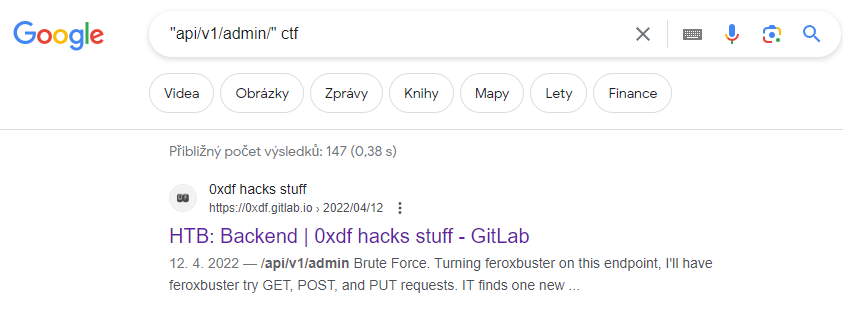

# U.S.A.

## Zadání

```
Ahoy, officer,

on our last port visit, a new U.S.A. (Universal Ship API) interface was installed on the ship. In order to unlock new experimental ship functions, the special code has to be entered into ship FLAG (First Layer Application Gateway). Your task is to get this FLAG code from U.S.A.

May you have fair winds and following seas!

The U.S.A. is available at http://universal-ship-api.cns-jv.tcc.

Hint: Status codes 4xx can be helpful.
```

## Řešení

### Enumerace

```bash
dirb http://universal-ship-api.cns-jv.tcc/

---- Scanning URL: http://universal-ship-api.cns-jv.tcc/ ----
+ http://universal-ship-api.cns-jv.tcc/api (CODE:200|SIZE:20)
+ http://universal-ship-api.cns-jv.tcc/docs (CODE:401|SIZE:30)
```

Na stránkách `api` je následující obsah: 

```
{"endpoints":["v1"]}
```

http://universal-ship-api.cns-jv.tcc/api/v1

```
{"endpoints":["user","admin"]}
```

http://universal-ship-api.cns-jv.tcc/api/v1/admin/

```
{"detail":"Not authenticated"}
```

http://universal-ship-api.cns-jv.tcc/api/v1/user/

```
{"detail":"Not Found"}
```

### Google

Na tomto místě jsem se na dlouho zasekl. Nakonec mě napadlo zkusit Google, protože endpointy jako `api/v1/admin/` se mi zdáli nějak povědomé a mohlo by se jednat o nějaký standard.



A hned první odkaz - bingo!
https://0xdf.gitlab.io/2022/04/12/htb-backend.html

Dále jsem již postupoval přesně podle uvedeného writeupu. 
Úlohy se pouze drobně liší - v The Catch bylo potřeba vygenerovat cookie pomocí RSA klíče, který šlo stáhnout ze serveru pomocí endpointu `/file`. V HTB se jednalo o HS256 a secret key uložený v souboru...


## Vlajka

```
FLAG{910P-iUeJ-Wwq1-i8L2}
```