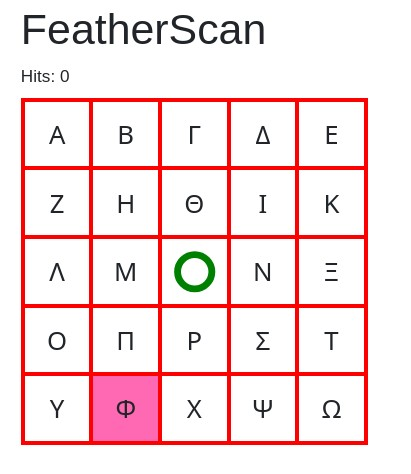
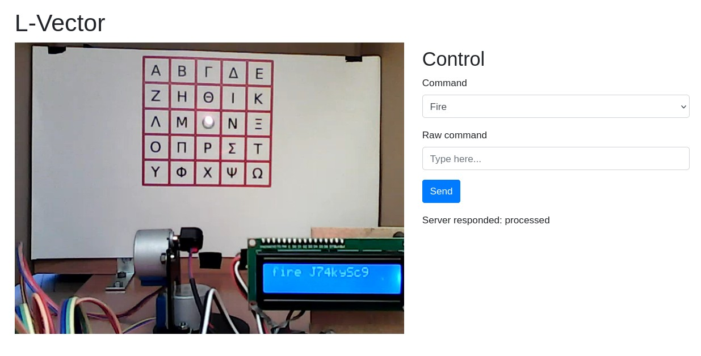

# Chapter 5: Hits

## Challenge

Hi, emergency troubleshooter,

recent studies suggest that the intense heat and hard labor of solar technicians often trigger strange, vivid dreams about the future of energetics. Over the past few days, technicians have woken up night after night with the same terrifying screams "Look, up in the sky! It's a bird! It's a plane! It's Superman! Let's roast it anyway!".

Find out what's going on, we need our technicians to stay sane.

Stay grounded!

http://intro.falcon.powergrid.tcc/

Hint: Be sure you enter flag for correct chapter.

Hint: In this realm, challenges should be conquered in a precise order, and to triumph over some, you'll need artifacts acquired from others - a unique twist that defies the norms of typical CTF challenges.

Hint: Chapter haiku will lead you.

Haiku:

```plain
Silent shields arise,
code weaving unseen barriers-
guardians without sleep. 
```

http://roostguard.falcon.powergrid.tcc/

## TL;DR

Two endpoints matter: **/radar** (shows the current target glyph/aim cell) and **/operator** (fires the laser).  
We automated reading the selected grid cell from `/radar` and sending **FIRE** commands via `/command`. After three successful hits, the flag appeared on the page.

## Scope & Targets

- Web app: `http://roostguard.falcon.powergrid.tcc/`
- Key endpoints:
  - `GET /radar` - shows a 5×5 **monitor-grid** table with a highlighted "aim-target" cell
  - `GET /operator` - fetches CSRF; page for the operator console
  - `POST /command` - send commands (e.g., `FIRExxxx`) with header `x-Csrftoken: <token>`



## Recon

- Tried firmware commands seen earlier (`AIMM`, `TURR`, `LASE`, etc.) → **Unauthorized** even when logged in.
- `FIRE` works and takes **two bytes (hex)** appended: `FIRE0000` (center). The UI uses this to fire into the middle. Upon firing, the **cookie prefix** is echoed to the device LCD (observed behavior).
- Hypothesis: the web app **translates `FIRE`** into a sequence of lower-level firmware calls (because `FIRE` isn’t present in the firmware itself).



## Board Parsing & Auto-Fire Script

We used a small Python helper (created by ChatGPT) to:

1. Pull the current **selected cell** (Greek-keyed grid) from `/radar`.
2. Convert the selected cell into **relative row/col** offsets (−2..+2).
3. Encode offsets into the `FIRE` two-byte payload.
4. `POST` to `/command` with `command=FIRE<hex>`.

[fire.py](fire.py)

```python
import requests
import time
import re
from typing import List, Dict, Tuple
from bs4 import BeautifulSoup  # type: ignore

def parse_board(html: str) -> Tuple[int, List[List[Dict]], str]:
    soup = BeautifulSoup(html, "html.parser")
    # Hits
    hits = 0
    m = re.search(r"\bHits:\s*(\d+)", soup.get_text(" ", strip=True))
    if m:
        hits = int(m.group(1))

    table = soup.select_one("table.monitor-grid")
    if not table:
        raise RuntimeError("monitor-grid table not found")

    board, selected_key = [], None
    for tr in table.select("tr"):
        row = []
        for td in tr.select("td"):
            key = td.get("data-key") or ""
            classes = td.get("class") or []
            is_selected = "aim-target" in classes
            text = td.get_text(strip=True)
            if not text and key == "center":
                text = "center"
            cell = {"key": key, "text": text, "selected": is_selected}
            row.append(cell)
            if is_selected:
                selected_key = key
        board.append(row)
    return hits, board, selected_key or ""

def pretty_print(board: List[List[Dict]]):
    # Print the board as keys, marking the selected cell with [key]
    for row in board:
        cells = []
        for c in row:
            label = c["key"] or c["text"] or "?"
            cells.append(f"[{label}]" if c["selected"] else f" {label} ")
        print(" | ".join(cells))

#################

cookies = {
    "session": "J74kySc9yhK37xm95ZoJzyfgPFKNvVgkz7hPD70KC84"
}

def fire(cmd):
    r = requests.get("http://roostguard.falcon.powergrid.tcc/operator", cookies=cookies)
    csrf = r.text.split('<meta name="csrf-token" content="')[1].split('"')[0]

    time.sleep(3)

    print("CSRF:", csrf)
    headers = {
        "x-Csrftoken": csrf,
    }
    data = {
        "command": "FIRE" + cmd,
    }
    r = requests.post("http://roostguard.falcon.powergrid.tcc/command", headers=headers, data=data, cookies=cookies)
    print(r.text)
    time.sleep(3)

def get_board():
    r = requests.get("http://roostguard.falcon.powergrid.tcc/radar", cookies=cookies)
    html = r.text
    time.sleep(3)
    return html

def to_code(n: int) -> int:
    o = n & 0xFF
    return hex(o)[2:].zfill(2)

for i in range(5):
    html = get_board()
    hits, board, selected = parse_board(html)
    if "FLAG" in html.upper():
        print(html)
        break
    print(f"Hits: {hits}")
    print(f"Selected: {selected or '(none)'}\n")
    pretty_print(board)

    if selected in ("alpha", "beta", "gamma", "delta", "epsilon"):
        row = -2
    elif selected in ("zeta", "eta", "theta", "iota", "kappa"):
        row = -1
    elif selected in ("lambda", "mu", "center", "nu", "xi"):
        row = 0
    elif selected in ("omicron", "pi", "rho", "sigma", "tau"):
        row = 1
    elif selected in ("upsilon", "phi", "chi", "psi", "omega"):
        row = 2

    if selected in ("alpha", "zeta", "lambda", "omicron", "upsilon"):
        col = -2
    elif selected in ("beta", "eta", "mu", "pi", "phi"):
        col = -1
    elif selected in ("gamma", "theta", "center", "rho", "chi"):
        col = 0
    elif selected in ("delta", "iota", "nu", "sigma", "psi"):
        col = 1
    elif selected in ("epsilon", "kappa", "xi", "tau", "omega"):
        col = 2

    col_code = to_code(col * 10)
    row_code = to_code(-row * 6)
    print(selected, row, col)
    code = col_code + row_code
    print("FIRE" + code)
    fire(code)
    time.sleep(5)
```

### Notes on encoding

- The grid uses **Greek keys** mapped to a 5×5 (-2 ... +2) offset in both axes.
- We encoded:
  - **column**: `col ∈ {−2..+2}` → multiply by **10**, then single‑byte hex (00..FF)
  - **row**: `row ∈ {−2..+2}` → multiply by **−6**, then single‑byte hex (00..FF)
- This worked for multiple glyphs, but not universally-likely the web layer applies **nonlinear transforms** or the glyph set requires **contextual offsets** (or more advanced aim corrections).

The script adjusted `FIRE` payload per the current **aim-target** cell. After **three successful hits**, the page displayed the **flag**.

## Flag

```plain
FLAG{dxOI-9Vrw-p4TK-DWuh}
```

Note: Another **first blood** achievement 